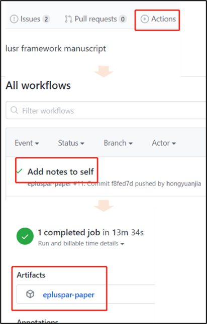

<!-- README.md is generated from README.Rmd. Please edit that file -->

# eplusr framework

<!-- badges: start -->

[](https://github.com/ideas-lab-nus/epluspar-paper/actions)
<!-- badges: end -->

This repository contains the data and code for our paper:

> Hongyuan Jia and Adrian Chong, (2020). *A framework for integrating
> building energy simulation and data-driven analytics*. Energy and
> Buildings <https://doi.org/xxx/xxx>

Our pre-print is online here:

> Hongyuan Jia and Adrian Chong, (2020). *A framework for integrating
> building energy simulation and data-driven analytics*. Energy and
> Buildings, Accessed 29 May 2020. Online at <https://doi.org/xxx/xxx>

### How to cite

Please cite this compendium as:

> Hongyuan Jia and Adrian Chong, (2020). *Compendium of R code and data
> for A framework for integrating building energy simulation and
> data-driven analytics*. Accessed 29 May 2020. Online at
> <https://doi.org/xxx/xxx>

### How to download or install

**(a) Option 1: Download the compiled draft PDF**

The latest compiled draft PDF can be downloaded from the `Artifacts`.



**(b) Option 2: Download the compendium and compile the PDF**

You can download the compendium as a zip from from this URL:
<https://github.com/ideas-lab-nus/epluspar-paper/archive/master.zip>

Or you can install this compendium as an R package, epluspar-paper, from
GitHub with:

``` r
# install.packages("remotes")
remotes::install_github("ideas-lab-nus/epluspar-paper")
```

The PDF can be compiled via:

``` r
rmarkdown::render('vignettes/paper.Rmd')
```

### Licenses

**Text and figures :**
[CC-BY-4.0](http://creativecommons.org/licenses/by/4.0/)

**Code :** See the [DESCRIPTION](DESCRIPTION) file

**Data :** [CC-0](http://creativecommons.org/publicdomain/zero/1.0/)
attribution requested in reuse

### Contributions

We welcome contributions from everyone. Before you get started, please
see our [contributor guidelines](.github/CONTRIBUTING.md). Please note
that this project is released with a [Contributor Code of
Conduct](.github/CONDUCT.md). By participating in this project you agree
to abide by its terms.
